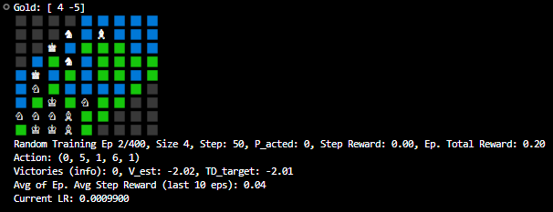

### A hobby project to learn reinforcement learning
Where I attempt to build and train an ANN from scratch such that it can play (well) a board game I made a while ago.

It may seem strange that square grid kernels are used in a board game with hexagonal tiles, but it works out as cube coordinates for a hexagonal grid are a 2D plane (see https://www.redblobgames.com/grids/hexagons/#coordinates). And topological features are preserved:

Roughly speaking, in a grid represented by (*q*, *r*) a 3x3 kernel sees:

|   |   |   |
|---|---|---|
| ❌ | ➕ | ➕ |
| ➕ | 🔵 | ➕ |
| ➕ | ➕ | ❌ |
|   |   |   |

With plus signs corresponding to the six tiles adjacent to a hexagon. The X's are at a distance of 2 from the central tile. It is likely that the network, when combining local features, can learn on its own to take into account the asymmetry in representation described above.

#### Best approaches:

1. With 50% winrate res_net_AC.py performs just as well as SimpleAI (in player.py) on map sizes (radii) up to four. (3x3 normal kernels, curriculum learning, residual convolutional blocks, embeddeding at beginning). RL algorithm is Actor-Critic TD($\lambda $) Policy Gradient in episodic self-play with separate eligibility traces tracking the separate trajectories of two players in an episode.

2. TBA

#### Game design
Terminal representation of game state:

Squares: green is land, blue is water, black does not exist (see grid discussion above). Map terrain is randomly generated with a 36% chance of each tile being water.

Pieces: a knight is a soldier, a bishop is a ship and kings are cities.

Rules:

*   **Objective:** Destroy all opponent cities.
*   **Turns:** Players alternate. Perform actions, then collect income/pay upkeep.
*   **Currency:** Gain +3 per city, pay -1 upkeep per unit (cities, soldiers, ships) end of turn. We have a steady state of one city sustaining two troops.
*   **Debt:** Negative currency makes your units take significantly more damage when attacked (from Soldiers: +1 dmg, from Ships: +1.5 dmg).
*   **Units & Costs:**
    *   **City:** HP 3. Builds soldiers and ships. Cost 10 (increases exponentially with count: `10 * 1.6**(N-1)`). Cannot move/attack.
    *   **Soldier:** HP 3. Cost 2. Moves 1 hex (land only). Attacks adjacent (1 dmg). Can build new Cities on adjacent empty land.
    *   **Battleship:** HP 3. Cost 10. Moves <=2 hexes (water only). Attacks within 2 hexes (1.5 dmg). Can also build new Cities on adjacent empty land.
*   **Terrain:** Hex grid (plains, hills, water). Soldiers and cities restricted to land, Ships to water.
